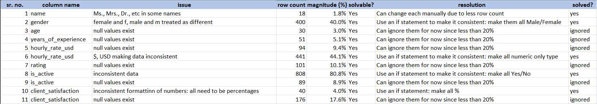

# Global Freelancers Dashboard

## Project Overview

This project analyzes a global freelancers dataset from the perspective of clients looking to hire freelancers across different roles and regions.
The primary objective is to help clients make better hiring decisions by balancing cost, experience, and expected quality rather than relying on hourly rates alone.

The analysis focuses on understanding:

1. How freelancer experience influences pricing?
2. How client satisfaction changes across pricing bands?
3. Which combinations of price and satisfaction deliver the highest value per dollar?
4. How does experience affect cost-adjusted client satisfaction?

To support these decisions, a cost-adjusted satisfaction metric (Value Index) was developed to identify scenarios where clients receive the highest satisfaction relative to what they pay.
The final output is an interactive Power BI dashboard that allows users to explore these trade-offs by role and country, enabling more informed and data-driven freelancer selection.

## Dataset Description

The dataset used in this analysis is a synthetic (dummy) global freelancers dataset sourced from Kaggle, created for practice and analytical exploration.
You can download it directly from Kaggle using [THIS LINK](https://www.kaggle.com/datasets/urvishahir/global-freelancers-raw-dataset) or it is also shared in this repository as [global_freelancers_raw.csv](global_freelancers_raw.csv).

The dataset contains:
- 1,000 rows, each representing an individual freelancer.
- 12 columns, covering attributes such as hourly rate, years of experience, client satisfaction, primary role, and country.

The raw dataset was not analysis-ready and contained several quality issues, including:
- Inconsistent data types across columns
- Null values
- Fields requiring standardisation before analysis

As a result, the dataset required extensive cleaning and transformation before it could be used for meaningful analysis.
All data preparation was carried out using Excel and Power Query, which served as the foundation for subsequent metric creation and visualization in Power BI.

## Tools & Technologies Used

The project was executed using the following tools, each serving a specific purpose in the analysis workflow:

1. **Microsoft Excel**:
Used for initial data inspection, issue identification, and documentation. Excel was also used to create derived categorical variables such as experience and age buckets.  
2. **Power Query (Excel)**:
Used for systematic data cleaning and transformation based on a predefined issue log. Power Query enabled consistent handling of data type inconsistencies and formatting issues across columns.  
3. **Power BI**:
Used for data modeling, interactive visualization, and dashboard creation.  
4. **DAX (Data Analysis Expressions)**:
Used to create analytical measures such as median hourly rate, average client satisfaction, and a cost-adjusted satisfaction metric (Value Index), which supported the key analytical questions.

## Data Quality Assessment & Cleaning Process

Before performing any analysis, the raw dataset was systematically reviewed column by column to identify data quality issues.
An issue log was created to document problems such as missing values, inconsistent data types, and formatting irregularities. This log is available in the issues_log worksheet of the [cleaned](cleaned.xlsx) Excel workbook.

Each issue was assessed based on:

- Row impact percentage
- Solvability
- Risk of bias if removed or ignored

Issues affecting a small proportion of rows (generally under 20%) were documented and retained without imputation, while high-impact inconsistencies were actively resolved.

Data cleaning was performed in Power Query, using the issue log as a checklist to address one column at a time.
After cleaning, a final validation pass was conducted to ensure:
- Consistent data types across all columns
- Standardized categorical values
- No unresolved critical inconsistencies

The cleaned dataset is stored in the cleaned_data worksheet of the [cleaned](cleaned.xlsx) workbook, and the final analysis-ready dataset, containing derived experience and age categories, is stored in the data_edited worksheet of the [cleaned](cleaned.xlsx) workbook.

## Key Insights & Findings

1. Early- to mid-career freelancers (0–10 and 11–20 years of experience) consistently deliver the highest cost-adjusted client satisfaction, combining relatively high satisfaction scores with lower median hourly rates. This indicates that higher experience does not necessarily translate into better value for money.

2. Lower pricing bands offer better overall value, with freelancers charging around $20 per hour delivering the highest satisfaction per dollar. While client satisfaction remains fairly stable across pricing bands, increases in hourly rates are not matched by proportional gains in satisfaction.

3. Client satisfaction shows diminishing returns at higher price points, remaining within a narrow range (approximately 78%–81%) even as hourly rates increase significantly. This suggests that paying more does not guarantee meaningfully higher perceived quality.

4. At a global level, and without role-specific filtering, Egypt emerges as the top country in terms of cost-adjusted client satisfaction, indicating a strong balance between affordability and quality. This result is sensitive to role and country filters and should be interpreted within the selected context.

5. All insights are interactive and context-dependent, allowing clients to refine conclusions by applying role and country filters based on their specific hiring needs.

## Limitations & Assumptions

- Synthetic dataset:
The analysis is based on a fictitious (synthetic) dataset sourced from Kaggle. While the data structure is realistic, the results should be interpreted as illustrative rather than representative of real-world freelance markets.

- Missing values were not imputed:
Null values present in the dataset were retained where their proportion was relatively low. No imputation was performed, as there was no reliable basis to infer the true values without introducing bias.

- Limited sample size:
The dataset contains approximately 1,000 records. While sufficient for exploratory analysis, some subgroups (e.g., very high experience levels or specific role-country combinations) have small sample sizes, which can reduce the reliability of aggregated metrics.

- Value Index favors lower-priced freelancers:
The cost-adjusted satisfaction metric inherently rewards lower hourly rates. While useful for identifying value-for-money scenarios, it may underrepresent the benefits of premium freelancers in highly specialized or mission-critical roles.

- No time dimension included:
The dataset does not contain temporal information. As a result, trends over time (e.g., changing pricing or satisfaction patterns) could not be analyzed.
